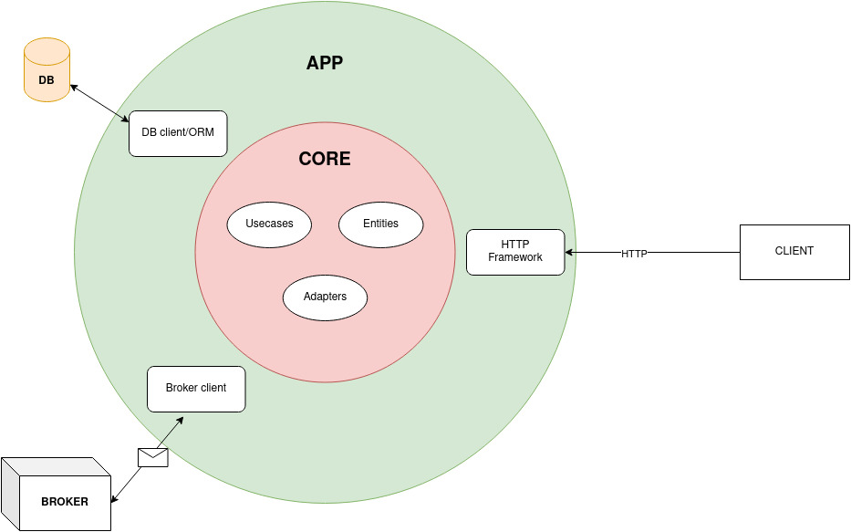

# Ruby microservice with clean architecture boilerplate

A simple ruby boilerplate of a microservice structure using clean architecture by Uncle Bob.

## Microservice architecture

This boilerplate follows the structure below:

In this repository, MongoDB and [Apache Kafka](https://kafka.apache.org/) were used to represent, respectively, DB and Broker, but any other database and message broker could be possible.

## Technologies/Libraries

- [Sinatra](http://sinatrarb.com/): A famous ruby DSL to handle with HTTP request/response.
- [ruby-kafka](https://github.com/zendesk/ruby-kafka): A kafka client for ruby.
- [Sidekiq](https://sidekiq.org/): To run background jobs efficiently.
- [Redis](https://redis.io/): A data structure store used by Sidekiq.
- [Mongoid](https://github.com/mongodb/mongoid): A MongoDB ODM for ruby
- [Rerun](https://github.com/alexch/rerun): to listen changes and reload the server
- [Rubocop](https://github.com/rubocop/rubocop): A linter for ruby
- [RSpec](https://rspec.info/): A famous ruby library for tests.
